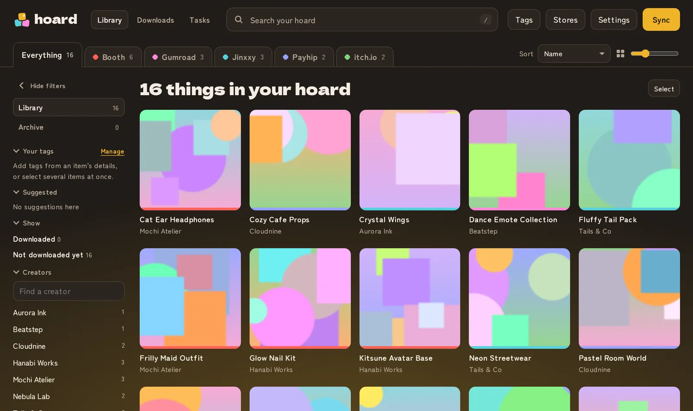
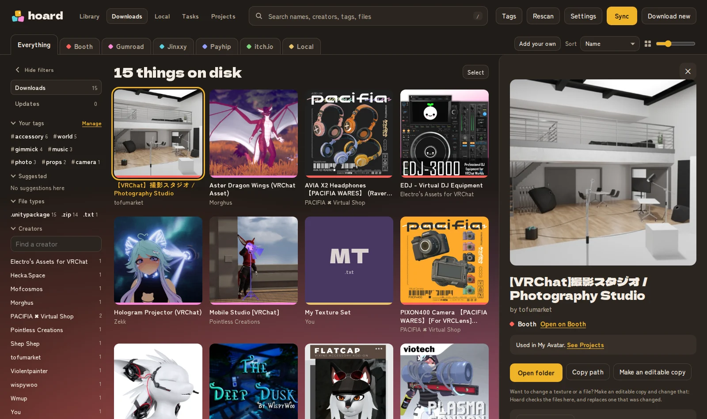
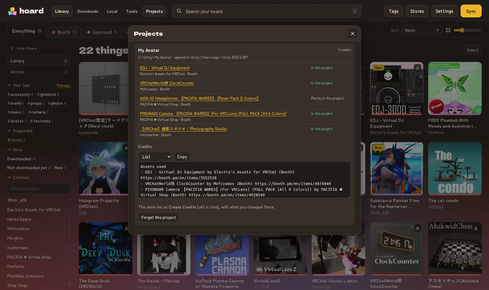
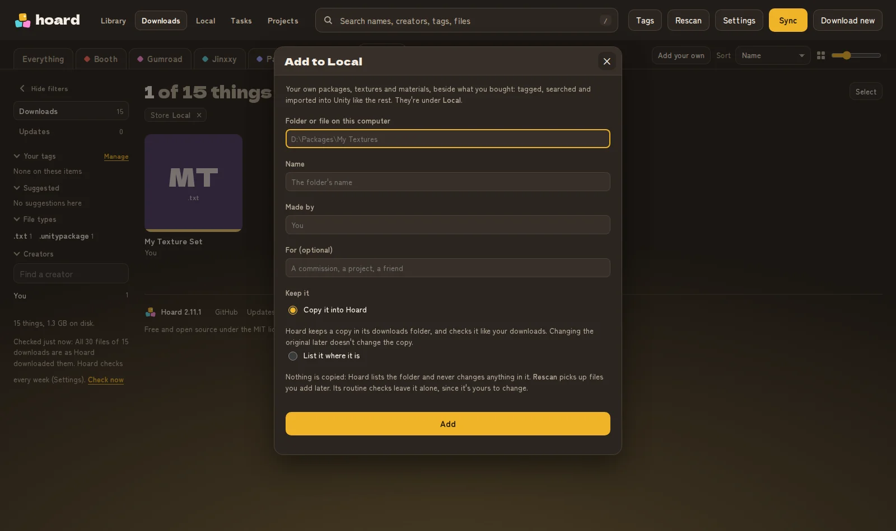
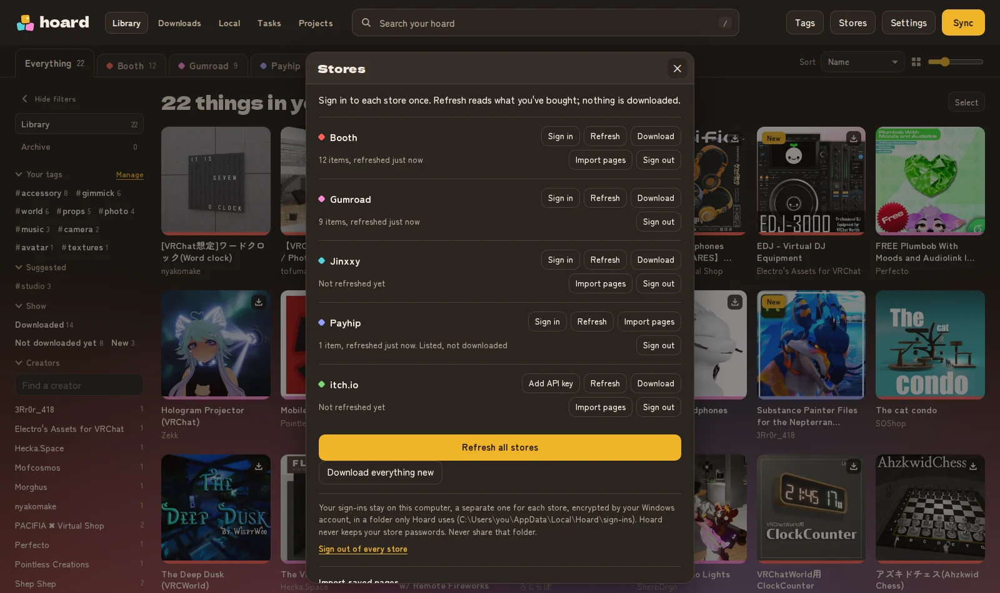

  <picture>
    <source media="(prefers-color-scheme: dark)" srcset="brand/logo-dark.svg">
    
  </picture>

<a href="README.md">English</a> · <b>日本語</b> · <a href="README.ko.md">한국어</a>

  
  
  
  
  
  

<b>買ったアバターアセットを、ぜんぶひとつの場所に。</b> 
Booth、Gumroad、Jinxxy、Payhip、itch.ioで購入したものを、検索・絞り込み・保管ができるひとつのライブラリにまとめます。

あのパーカー、買ったのはBoothでしたか、それともGumroad?クリエイターはアップデートしましたか?ファイルはまだ手元にありますか?
Hoardなら、タブを4つも開かずに答えが分かります。

> **このページとHoardの日本語訳は、AIの助けを借りて作りました。** 不自然な表現や誤りがあるかもしれません。見つけたら[翻訳の修正](https://github.com/Soloflighter1010/Hoard-Asset-Manager/issues/new?template=translation.yml)で教えてください。
>
> このページは英語版の[README](README.md)の翻訳です。内容が異なる場合は英語版が正しい情報です。Hoardのアプリ自体も日本語で使えます(**設定 › 外観 › 言語**、または初回セットアップの最初の画面で選べます)。

- **ライブラリ:** Booth、Gumroad、Jinxxy、Payhip、itch.ioで持っているものを、検索・絞り込み・タグづけができる1つのページに。複数のストアで持っている商品も見つけます。
- **ダウンロード:** `<ストア>/<クリエイター>/<商品>` の整ったフォルダーにローカルコピーを保存し、クリエイターがファイルを更新したら最新に保ちます(Payhipは一覧表示のみで、ダウンロードはしません。下記参照)。
- アプリもサインインもタグもひとつだけ。オフラインでも使えます。

<picture>
  <source srcset="site/img/library-light.webp" media="(prefers-color-scheme: light)">
  
</picture>
<picture>
  <source srcset="site/img/downloads-details-light.webp" media="(prefers-color-scheme: light)">
  
</picture>
<picture>
  <source srcset="site/img/projects-light.webp" media="(prefers-color-scheme: light)">
  
</picture>
<picture>
  <source srcset="site/img/local-add-light.webp" media="(prefers-color-scheme: light)">
  
</picture>
<picture>
  <source srcset="site/img/stores-light.webp" media="(prefers-color-scheme: light)">
  
</picture>

ライブラリ、ダウンロード、プロジェクト、自分のパッケージ、ストアの画面です。メンテナー自身のライブラリにある実際の商品を、クリエイターの画像とともに表示しています。<a href="https://hoard.furryup.link/credits.html">それぞれの作者と入手先</a>。素敵な作品をありがとうございます。

インストールからトラブル解決まで、すべてのガイドは**[wiki](https://github.com/Soloflighter1010/Hoard-Asset-Manager/wiki)**(英語)にあります。

---

## 📖 目次
- [インストール(Windows)](#install-windows)
- [インストール(macOS・Linux)](#install-macos-linux)
- [Hoardの使い方](#using-hoard)
- [UnityでHoardを使う](#hoard-in-unity)
- [Hoardがあなたを守るしくみ](#keeping-you-safe)
- [サインイン情報](#sign-ins)
- [タグ](#tags)
- [オフライン](#offline)
- [知っておいてほしいこと](#things-to-know)
- [問題の報告と貢献](#reporting)
- [開発者向け](#developers)
- [法的情報](#legal)

---

## インストール(Windows)

1. [Releases](https://github.com/Soloflighter1010/Hoard-Asset-Manager/releases/latest)から **`Hoard-Setup-<バージョン>.exe`** をダウンロードして実行します。自分のアカウントだけにインストールされ、管理者の確認は出ません。スタートメニューにHoardが追加されます。
2. リリース直後はしばらく **「WindowsによってPCが保護されました」** と表示されることがあります。Hoardはコード署名されています(**詳細情報**を選ぶと、発行元としてHoardのメンテナーが表示されます)が、新しい発行元はまずMicrosoftの信頼を得る必要があります。[CODE_SIGNING.md](CODE_SIGNING.md)(英語)をご覧ください。**実行**を選んでください。ダウンロードがこのプロジェクトのGitHubビルドから来たものか確かめるには:`gh attestation verify Hoard-Setup-<バージョン>.exe -R Soloflighter1010/Hoard-Asset-Manager`
3. スタートメニューから **Hoard** を開きます。専用のウィンドウで開きます。短いセットアップアシスタントが、言語、使うストア、各ストアへのサインイン、Payhipのショップ、ダウンロードの保存先を順番に案内します。**設定** の **Hoardをもう一度セットアップ** からいつでもやり直せます。

**アップデート:** **設定** の **アップデート** で **今すぐ確認** を選び、新しいバージョンへの **アップデート** を選びます。Hoardがダウンロードし、リリースのチェックサムと照合してから終了し、インストールしてもう一度開きます(**アップデートを自動で確認** をオンにすると、新しいバージョンが出たときに知らせます。オンにしない限りオフです)。新しいセットアップを自分で実行してもかまいません。先にアンインストールする必要はありません。設定、ライブラリ、サインイン、タグはHoardのアプリデータフォルダー(`%LOCALAPPDATA%\Hoard`)に、ダウンロードはダウンロードフォルダーにあるので、インストール・アップデート・アンインストールで消えることはありません。

インストーラーを使いたくない場合は、`Hoard-<バージョン>-windows.zip` も同じアプリです。好きな場所に展開して `Hoard.exe` を実行してください。HoardのウィンドウはMicrosoft Edge WebView2を使います(Windows 11には含まれ、Windows 10でも自動で最新に保たれます)。WebView2がない場合は、代わりにWebブラウザーで開きます(終了は **設定** から)。

## インストール(macOS・Linux)

- **macOS 11以降:** [Releases](https://github.com/Soloflighter1010/Hoard-Asset-Manager/releases/latest)から `Hoard-<バージョン>-macos-apple-silicon.pkg`(MシリーズのMac)または `Hoard-<バージョン>-macos-intel.pkg` をダウンロードして開きます。まだAppleの署名がないため、最初は開けません。**完了** を選び、**システム設定 › プライバシーとセキュリティ › このまま開く** を選んでください。Hoardは **アプリケーション** に入ります。
- **Linux(x86_64):** `Hoard-<バージョン>-linux-x86_64.flatpak` をダウンロードしてソフトウェアセンターで開くか、`flatpak install --user Hoard-<バージョン>-linux-x86_64.flatpak` を実行します。[Flathub](https://flathub.org/setup)のGNOMEランタイムを使います。

どちらもHoard専用のウィンドウで開きます。アップデートするには、新しいファイルを同じ方法でインストールします(どれを使うかは **設定 › アップデート** に表示されます)。詳しくは[Installing Hoard](https://github.com/Soloflighter1010/Hoard-Asset-Manager/wiki/Installing-Hoard)(英語)をご覧ください。

**ソースから(どのOSでも):** [Python 3.10以降](https://www.python.org/downloads/)をインストールし、`Hoard-<バージョン>.zip` をダウンロード・展開して、`Hoard.bat`(Windows)または `./run.sh` を実行します。専用のPython環境を用意し(すべてのパッケージを記録済みのフィンガープリントと照合します)、Hoardを開きます。

**Hoard 1.xから移行する場合:** サインインとタグは自動で引き継がれます。ライブラリの一覧とダウンロードフォルダーは、セットアップアシスタントで1.xを動かしていたフォルダーを選ぶと移せます。

## Hoardの使い方

- **同期**(右上)は、使っている各ストアから持っているものを読み込み、新しいものをまとめてダウンロードします。進み具合が表示され、**停止** で安全に一時停止できます。
- **ストア**(右上):専用のブラウザーウィンドウで、各ストアに一度だけサインインします。**更新** で購入したものを読み込みます。**ダウンロード** でそのストアの新しいものをすべてローカルに保存し、**新しいものをすべてダウンロード** ですべてのストアをまとめて行います。
- **ページを取り込む**(**ストア** 内)は、いつものブラウザーで保存したライブラリページ(Ctrl+S、「ウェブページ、単一ファイル」)を代わりに読み込みます。何件でも一度に選べ、フォルダーごとでも、ウィンドウにドロップしてもかまいません。ストアに更新をブロックされたときや、そこにサインインしたくないときに便利です。
- **ライブラリ** には持っているものすべてが表示されます。商品を開くと、詳細の確認、タグづけ、ストアのページを開く、**ダウンロード** ができます。すでに持っているものには **ディスク上** と表示され、ダウンロードへのリンクと、画像に小さなダウンロードの印がつきます。左の **ダウンロード済み** と **未ダウンロード** でそれだけを表示できます。
- **タスク** には、実行中のもの、順番待ちのもの、終わったものが進み具合とともに表示されます。ほかの作業中に何かを始めても、断られずに順番待ちに入ります。タスクから外すこともできます。
- **タグ**、**ストア**、**設定** は、動かしたりサイズを変えたりできるウィンドウで開き、並べて開いておけます。設定は変えるとすぐに保存されます。
- **ダウンロード** には、コンピューターにあるものがファイル、サイズ、フォルダーとともに表示されます。**新しいものをダウンロード** で新しいものや更新されたものを取得し、進み具合が表示されます。**停止** で安全に一時停止し、次回続きから再開します。**アップデートを確認**(**アップデート** 内)は、ダウンロードした後にクリエイターが追加・変更したものを、何もダウンロードせずに一覧にします。そのあと1つずつ **アップデート** するか、**すべてアップデート** します。**中身を見る**(商品のファイル一覧で `.unitypackage` や `.zip` の横)は、何も展開せずに、中のファイルをフォルダーごとに、Unityが保存しているプレビューとともに表示します。`.zip` なら、中の各Unityパッケージの中身も見られます。**必要なもの**(商品の詳細)には、そのパッケージが使っていて中に入っていないものが表示されます。lilToon、Poiyomi、Modular Avatarなどのシェーダーやツールと、ほかの商品(素体など)のファイルも使っているかどうかです。アップデートでファイルが置き換わると、古いものは残ります(**以前のバージョン**、**元に戻す** で戻せます)。**セット** で一緒に使う商品(素体、衣装、シェーダー)をまとめると、Hoard for Unityでまとめてインポートできます。
- **バックアップ**(**設定** 内)は、設定、タグ、セット、選んだ内容、ライブラリの一覧(サインインやキーは入りません)を1つのファイルに保存し、保管や別のコンピューターへの引っ越しに使えます。そこから戻すこともできます。
- **Payhip** は一覧表示のみで、ダウンロードはしません。Payhipで買ったものすべてを、各商品のダウンロードページとともに表示します。ファイルはPayhipでご自身でダウンロードしてください。Payhipは購入品を、購入したショップごとに1つのライブラリページで保管しています。いちばん簡単なのは、各ショップのライブラリページ(全ページ)を保存してまとめて取り込む方法です。まだ追加していないショップは、確認すると追加されます。または **設定** の **Payhipのショップ** にショップを追加して(アドレスは購入時のメールに載っています)更新してください。Payhipは自動操作のブラウザーを確認するため、確認を済ませられるウィンドウが開きます。
- **itch.io** は、itch.io公式アプリと同じく、パスワードの代わりにAPIキーでサインインします(itch.ioのWebサイトは自動操作のブラウザーでのサインインを許可していません)。**ストア** のitch.ioの行で **APIキーを追加** を選ぶと、Hoardがキーの作り方を案内し、itch.ioで確認して、OSで保護して保存します。そのあと、itch.ioのライブラリにあるもの(購入したもの、バンドルや「価格は自由」のページで受け取ったもの)をすべて読み込んでダウンロードし、各ファイルをitch.ioのチェックサムと照合します。2.5.0より前にHoardを設定した場合は、先に **設定** でitch.ioをオンにしてください。ゲームのビルド(クリエイターがWindows、macOS、Linux、Android用としたファイル)は、**設定** でゲームのビルドのスキップをオフにしない限りスキップされるので、ゲームの入ったライブラリでもドライブがいっぱいになりません。
- **保存したパスワードなしでサインインする:** Hoardのウィンドウは専用のブラウザーなので、いつものブラウザーに保存したパスワードは使えません。アシスタントが、Chrome、Edge、Firefox、Safari、パスワードマネージャーでパスワードを見つけてコピーする方法を案内します。ストアからサインインや確認のリンクがメールで届いたら、クリックせずにアシスタントに貼り付けると、Hoardのウィンドウで開きます。
- **アーカイブ、削除済み、非表示**(左側):商品を開くか、**選択** で複数選んで、じゃまな古い商品を **アーカイブ**(Gumroadでアーカイブした購入品もここから始まります)、関係ないものを **削除**(更新してもライブラリに戻りません。**削除済み** から完全に削除できます)、またはPINで守って **非表示** にできます。非表示のものは、そのブラウザーでロックを解除するまで、ダウンロードも含めどこにも表示されません。これはプライバシー用の目隠しで、暗号化ではありません。ディスク上のファイルは普通のファイルのままです。PINを決めると、Hoardが6つの復元ワードを一度だけ表示します。書き留めておいてください。非表示のものを失わずにPINをリセットするために必要です。
- **設定** では、ダウンロードの保存先(選ばなければドキュメント内の `Hoard` フォルダー)、含めるストア、ストアのサインインに使うブラウザー(選ばなければMicrosoft Edge)、表示する言語を選べます。
- **タグ** はどちらの画面でも同じように使えます。下の[タグ](#tags)をご覧ください。

## UnityでHoardを使う

**Hoard for Unity** は、HoardがダウンロードしたものをUnityエディターに持ち込みます。**Hoard › Open Hoard**(Unityのメニューバーにある専用のメニュー)を開くと、サムネイルつきでダウンロードを検索し、開いているプロジェクトにすでに入っている商品を確認し(各 `.unitypackage` 内のアセットのGUIDから読み取ります)、Unity自身のインポート画面で **Import** できます。もう一度ダウンロードする必要はありません。商品が `.zip` に入っている場合(Boothの商品によくあります)も、その `.zip` の下に表示され、**Import** でそのパッケージだけを展開して同じ画面を開きます。そのプロジェクトにないもの(シェーダーやツール)が必要な商品は、それを表示し、**Import** の前に確認します。Hoardのカタログを読むだけで、Hoardの封印を確認し、エディター専用なので、アップロードするものには何も入りません。(Hoard for Unityの画面は今のところ英語です。)

VRChat Creator Companionで追加するには、[HoardのWebサイト](https://hoard.furryup.link/#unity)を開いて **Add to VCC** を選ぶか、**Settings › Packages › Add Repository** を開いて `https://hoard.furryup.link/index.json` を貼り付けます。そのあと、プロジェクトに **Hoard** を追加します。VCCを使わない場合は、[Releases](https://github.com/Soloflighter1010/Hoard-Asset-Manager/releases?q=unity-v&expanded=true)ページのリリース(「Hoard for Unity ...」、タグ `unity-v...`)から `.unitypackage` をインポートしてください。詳しくは[Packages/soloflighter.hoard/README.md](Packages/soloflighter.hoard/README.md)(英語)をご覧ください。

スクリプトやデスクトップのないコンピューター向けに、すべての機能はコマンドラインからも使えます:[docs/COMMAND-LINE.md](docs/COMMAND-LINE.md)(英語)

## Hoardがあなたを守るしくみ

あなたを守っているものを、分かりやすい言葉で説明します。技術的な詳細は[SECURITY.md](SECURITY.md)(英語)にあります。

**ストアのアカウント**
- **Hoardがあなたのパスワードを見ることはありません。** サインインはストア自身のページで行います。Hoardが保存するのは、ストアが発行する「サインインしたままにする」ための通行証だけで、いつものブラウザーが保存するものと同じです。
- **その通行証はあなたのコンピューターでロックされています。** Windowsアカウント、MacのキーチェーンまたはLinuxのキーリングで暗号化されるので、Hoardのファイルを別のコンピューターにコピーしても誰も使えません。
- **ストアごとに別々に保管されます。** BoothのサインインとGumroadのサインインが混ざることはありません。
- **サインアウトすると本当にサインアウトします。** Hoardはストアにセッションの終了を求め、保存したものを削除し、何も残っていないことを確かめてから、何をしたかを伝えます。そのストアの商品もライブラリから外れるので、次にサインインした人にあなたの購入品が見えることはありません。ダウンロードしたファイルは残ります。

**あなたのコンピューター**
- **Hoardのページを見られるのはあなただけです。** Hoardを動かしているコンピューターでしか開きません。ほかの機器と共有するにはあなたがオンにする必要があり、そのときは安全な接続とキーが必要です。
- **Webサイトから悪用されることはありません。** ほかのサイトはHoardのページを読んだり、ボタンを押したり、自分のページの中に隠したりできません。
- **ストアからのものがあなたのコンピューターで実行されることはありません。** ストアの名前、リンク、画像は、ただのテキストと普通の画像として表示され、コードとしては扱われません。
- **ダウンロードは決められた場所にだけ届きます。** すべてのダウンロードとストアへのリクエストは各段階で確認されます。安全な接続のみで、あなたのコンピューターや家庭内ネットワークには向かわず、ストアのサインイン情報はそのストアにだけ送られ、ファイルを置いているサーバーには送られません。
- **家庭内ネットワークには入りません。** 商品の画像はインターネット上からだけ取得し、ルーターやNAS、ほかの機器からは取得しません。

**あなたのファイル**
- **ダウンロードはダウンロードフォルダーの中にだけ保存されます。** ストアが送ってきたものも、Hoardの記録に書き込まれたものも、ほかの場所にファイルを保存させることはできません。
- **ファイル名で別のものになりすますことはできません。** プログラムの名前を画像のように見せかける隠し文字(実際の名前が `Hoodie…exe` のファイルを `Hoodie…jpg` と見せるもの)は取り除かれます。
- **ストアのボタンは本物のストアにだけ向かいます。** **Boothで開く** ボタンはbooth.pmしか開けないので、偽のサインインページにすり替えられることはありません。
- **改ざんは気づかれます。** Hoardは書き込むすべての記録に封印をします。ほかのプログラムが変更すると、Hoardがそれを伝え、確認用にコピーを残し、変更されたリンクは信用しません。
- **壊れたファイルがあっても何も壊れません。** 確認できるよう別に置かれ、Hoardはそのまま動き続けます。

**Hoard自体**
- **同じコンピューターのほかの人はHoardを変更できません。** セットアップで、プログラムのファイルはあなたのアカウントしか変更できないようにします。
- **セットアップがインストールするものは確認されます。** すべてのパッケージは事前に記録されたフィンガープリントと照合されるので、改ざんされたものはインストールされません。ブラウザーは公式の配布元から、決まったバージョンで取得します。
- **リリースは公開の場でビルドされます。** GitHubがソースコードから直接各リリースをビルドし、チェックサムとともに公開するので、ダウンロードが本物か確認できます。
- **すべての変更は、リリース前に自動でセキュリティテストされます。**

**あなたのプライバシー**
- **開発者には何も送られません。** アカウントも、トラッキングも、分析も、広告もありません。Hoardが通信するのはあなたが使うストアだけです。保存するものと削除方法はすべて[PRIVACY.md](PRIVACY.md)(英語)にあります。
- 更新、サインイン、ダウンロード以外は、**オフラインでも使えます**。

**どのアプリでも防げないこと**
- **すでにコンピューターにいるマルウェア。** あなたとして動くウイルスは、あなたと同じようにサインイン済みのストアを使えます。コンピューターを最新に保ち、スキャンしてください。
- **あなたのコンピューターの管理者権限を持つ人。**
- **ストア自身のWebサイトの問題。**

**ご自身でも安全に**
- Hoardは、ユーザーフォルダーの中など、自分専用のフォルダーに置いてください。
- Hoardのアプリデータフォルダー(下記)は誰とも共有しないでください。サインイン情報が入っています。
- トラブル解決用のファイルを共有する前に、中身を確認してください。何を買ったかが分かることがあります。
- 新しいバージョンが出たらアップデートしてください(**設定**、**アップデート**)。

## サインイン情報

各ストアには、Hoard専用のブラウザーウィンドウ(いつものブラウザーではありません)で一度だけサインインします。ライブラリとダウンロードで共有するので、サインインは一度で済みます。ストアごとに1つのフォルダーで、ここに保存されます:

| Windows | macOS | Linux |
|---|---|---|
| `%LOCALAPPDATA%\Hoard\sign-ins` | `~/Library/Application Support/Hoard/sign-ins` | `~/.local/share/Hoard/sign-ins` |

- **macOS** では、Hoardのブラウザーがキーチェーンを使ってよいか一度だけ尋ねられます。**常に許可** を選んでください。
- **Linux** では、保護のためにキーリングが必要です(GNOME Keyring、Secret Serviceを有効にしたKeePassXC、またはKWallet)。ない場合、Hoardはサインインを保存しません。NASのようなデスクトップのないコンピューターでは、Hoardの `config.json` に `"allow_unprotected_signins": true` を設定すると許可できます。その場合、サインイン情報はあなたのユーザーアカウントだけが読めることでのみ守られます。
- **サインアウト:** **ストア** から、1つのストアまたはすべてのストアについて行えます。そのストアの商品はライブラリから外れる(ダウンロードしたファイルは残ります)ので、コンピューターを共有しても2人の購入品が混ざりません。
- **以前のバージョンのサインイン情報**(1つの共有フォルダー、またはプログラムの隣の `.browser-profile`)は、初回起動時に自動でストアごとのフォルダーに分けられ、古いコピーは削除されます。

**1つのダウンロードフォルダーを2台のコンピューターで使う場合**(NASなど):各コンピューターのHoardは自分のキーで記録に封印するので、相手の変更を未確認として扱い、ストアのリンクをもう一度取得します。フォルダーを共有するには、一方のコンピューターのHoardのアプリデータフォルダーにある `integrity.key` を、もう一方の同じ場所にコピーしてください。

## タグ

Hoardには2種類のタグがあります:

- **あなたのタグ:** 自分で作って商品につけるタグ。
- **おすすめのタグ:** いくつもの商品名に出てくる言葉(`FoxyHoodie v2` なら `foxy` と `hoodie`)。つなぎの言葉やバージョン番号は除かれます。

タグのつけ方:

- **1つの商品:** 商品を開き、**タグ** の下にタグを入力するか、おすすめをクリックして追加します。タグの横の×で外せます。追加したタグは、ほかのストアで持っている同じ商品のすべてのコピーにつきます。
- **複数の商品:** **選択** を選んで商品をクリックし(クリエイターなどで絞り込んでから **表示中をすべて選択** も使えます)、タグを入力して **タグを追加** または **タグを外す** を選びます。
- **タグの画面**(**タグ** ボタン)には、すべてのタグとおすすめが表示されます:
  - おすすめを **残す** と、その言葉が名前に入っているすべての商品(これから買うものも含む)につくあなたのタグになります。**非表示** にすると、おすすめに出なくなります。
  - タグの **名前を変更** できます。既存のタグと同じ名前にすると、2つが1つにまとまります。
  - **名前と一致させる** で、どのタグにもこの自動の一致をつけられます。**削除** でタグを削除します。

タグはHoardの非公開のアプリデータフォルダー(Windowsでは `%LOCALAPPDATA%\Hoard\tags.json`)に保存され、ライブラリとダウンロードで共有されます。片方でタグをつけると、もう片方でもついています。サイドバーからどのタグでも絞り込め、絞り込みは組み合わせられます。

## オフライン

更新、サインイン、ダウンロード以外は、インターネットに接続していなくても使えます。更新のたびにすべての商品画像を保存するので、ライブラリ全体も検索も画像もオフラインで使え、書体もアプリに含まれています。ストアにつながらないときはHoardがそう伝え、保存したライブラリとダウンロードはそのまま残ります。

## 知っておいてほしいこと

- Hoardは非公式のツールで、Booth(pixiv)、Gumroad、Jinxxy、Payhip、itch.ioとは提携しておらず、承認も受けていません。あなた自身のアカウントの購入品を、あなた自身のサインインで読み込むだけです。
- ストアはWebサイトを変更します。変更されると、そのストアの読み込みが更新されるまで動かなくなることがあります。Payhipはすでに自動操作のブラウザーを確認しています。Hoardはあなたの手を借りてこれに対応します(確認を済ませられる見えるウィンドウ、または自分のブラウザーで保存したページ)。
- ダウンロードしても、アセットについてできることは変わりません。各クリエイターのライセンスと各ストアの規約に従ってください。

## 問題の報告と貢献

Issueやディスカッションは日本語でもかまいません。

- **バグと問題:** 不具合を見つけたら、何をして何が起きたかを書いて[バグ報告](https://github.com/Soloflighter1010/Hoard-Asset-Manager/issues/new?template=bug_report.yml)を開いてください。ストアが正しく読み込まれない場合は、`Hoard.bat debug <ストア>` または `Hoard.bat probe jinxxy` を実行して出力を添付してください。ただし、先に中身を確認してください。これらのファイルには購入品が、スクリーンショットにはアカウント名が写ることがあります。
- **機能の要望:** 使い勝手を良くするアイデアがあれば、[機能の要望](https://github.com/Soloflighter1010/Hoard-Asset-Manager/issues/new?template=feature_request.yml)を開いてください。
- **新しいストア:** ほかのストアに対応してほしい場合は、[ストア対応の要望](https://github.com/Soloflighter1010/Hoard-Asset-Manager/issues/new?template=storefront_integration.yml)を送ってください。
- **ディスカッションとサポート:** 一般的な質問は[Discussions](https://github.com/Soloflighter1010/Hoard-Asset-Manager/discussions)でスレッドを立ててください。
- **翻訳:** 日本語の訳はAIの助けを借りて作りました。おかしいところがあれば[翻訳の修正](https://github.com/Soloflighter1010/Hoard-Asset-Manager/issues/new?template=translation.yml)で教えてください。訳は `hoard/web/i18n/ja.json` にあります。
- **セキュリティの問題:** [SECURITY.md](SECURITY.md)(英語)の方法で、非公開で報告してください。

## AIを使って作成

Hoardのコード、デザイン、ドキュメントの大部分は、メンテナーの指示とテストのもとでAIアシスタント(AnthropicのClaude)が書いたものです。それがあなたにとって何を意味するかは[AI-DISCLOSURE.md](AI-DISCLOSURE.md)(英語)で説明しています。日本語と韓国語の翻訳も、このページを含めてAIの助けを借りて作りました。Hoard自体はAIを使っておらず、あなたのデータがAIに送られることはありません。

## 開発者向け

Hoardのしくみ(ストアの読み込み、サインイン、ローカルサーバーとその安全のルール、リリースの作り方)は[docs/ARCHITECTURE.md](docs/ARCHITECTURE.md)(英語)で説明しています。テストとリリースの手順は、wikiの[Development](https://github.com/Soloflighter1010/Hoard-Asset-Manager/wiki/Development)と[Releasing](https://github.com/Soloflighter1010/Hoard-Asset-Manager/wiki/Releasing)のページ(英語)にあります。開発者向けの詳細は[英語版のREADME](README.md#for-developers)をご覧ください。

## 法的情報

- [LICENSE](LICENSE):MIT
- [TERMS.md](TERMS.md):利用規約
- [PRIVACY.md](PRIVACY.md):プライバシーポリシー
- [COPYRIGHT.md](COPYRIGHT.md):著作権、名前とロゴ、サードパーティのソフトウェアとクレジット
- [SECURITY.md](SECURITY.md):セキュリティの問題の報告
- [CODE_SIGNING.md](CODE_SIGNING.md):コード署名のポリシー

法的文書は英語版が正式なものです。ロゴのファイルは `brand/` にあります。ワードマークはDela Gothic Oneからアウトライン化しているので、フォントをインストールする必要はありません。
